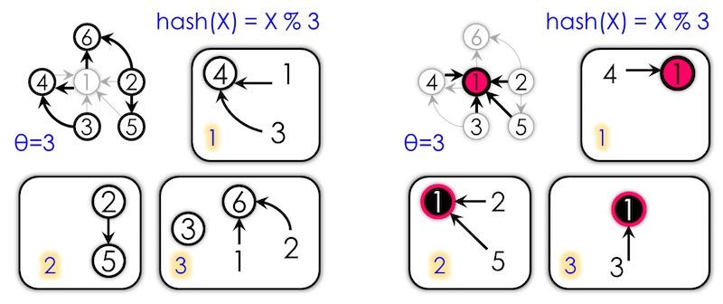

# PowerLyra v1.0
## License

PowerLyra is released under the [Apache 2 license](http://www.apache.org/licenses/LICENSE-2.0.html).

If you use PowerLyra in your research, please cite our paper:
```    __
    @inproceedings{Chen:eurosys2015powerlyra,
     title = {PowerLyra: Differentiated Graph Computation and Partitioning on Skewed Graphs},
     author = {Chen, Rong and Shi, Jiaxin and Chen, Yanzhe and Chen, Haibo},
     booktitle = {Proceedings of the Tenth European Conference on Computer Systems},
     series = {EuroSys '15},
     year = {2015},
     location = {Bordeaux, France},
    }
```


## Introduction

PowerLyra is based on the latest codebase of GraphLab PowerGraph (a distributed graph computation framework written in C++) and can seamlessly support all GraphLab toolkits. PowerLyra provides several new hybrid execution engines and partitioning algorithms to achieve optimal performance by leveraging input graph properties (e.g., power-law and bipartite). 

PowerLyra New Features:

* **Hybrid computation engine:** Exploit the locality of low-degree vertices and the parallelism of high-degree vertices

* **Hybrid partitioning algorithm:** Differentiate the partitioning algorithms for different types of vertices

* **Diverse scheduling strategy:** Provide both synchronous and asynchronous computation engines

* **Compatible API:** Seamlessly support all GraphLab toolkits 

For more details on the PowerLyra see http://ipads.se.sjtu.edu.cn/projects/powerlyra.html, including new features, instructions, etc.


### Hybrid Computation Engine

We argue that skewed distribution in natural graphs also calls for differentiated processing of high-degree and low-degree vertices. PowerLyra uses Pregel/GraphLab-like computation models for process low-degree vertices to minimize computation, communication and synchronization overhead, and uses PowerGraph-like computation model for process high-degree vertices to reduce load imbalance, contention and memory pressure. PowerLyra follows the interface of GAS (Gather, Apply and Scatter) model and can seamlessly support various graph algorithms (e.g., all GraphLab toolkits).


### Hybrid Graph Partitioning

PowerLyra additionally proposes a new hybrid graph cut algorithm that embraces the best of both worlds in edge-cut and vertex-cut, which evenly distributes low-degree vertices along with their edges like edge-cut, and evenly distributes edges of high-degree vertices like vertex-cut. Both theoretical analysis and empirical validation show that the expected replication factor of random hybrid-cut is alway better than both random (Hash-based), contrained (e.g., Grid), and heuristic (e.g., Oblivious or Coordinated) vertex-cut for skewed power-law graphs. 




## Academic and Conference Papers

Rong Chen, Jiaxin Shi, Yanzhe Chen and Haibo Chen. "[PowerLyra: Differentiated Graph Computation and Partitioning on Skewed Graphs](http://ipads.se.sjtu.edu.cn/projects/powerlyra/powerlyra-eurosys-final.pdf)." Proceeding of the 10th ACM SIGOPS European Conference on Computer Systems (EuroSys). Bordeaux, France. April, 2015.

Rong Chen, Jiaxin Shi, Binyu Zang and Haibing Guan. "[BiGraph: Bipartite-oriented Distributed Graph Partitioning for Big Learning](http://ipads.se.sjtu.edu.cn/projects/powerlyra/bigraph-apsys14.pdf)." Proceeding of the 5th Asia-Pacific Workshop on Systems (APSys). Beijing, China. June, 2014.

Rong Chen, Jiaxin Shi, Haibo Chen and Binyu Zang. "[Bipartite-oriented Distributed Graph Partitioning for Big Learning](http://ipads.se.sjtu.edu.cn/projects/powerlyra/bigraph-jcst.pdf)." Journal of Computer Science and Technology (JCST), 30(1), pp. 20-29. January, 2015.


## Building

The building, installation and tutorial of PowerLyra fully follow that of GraphLab PowerGraph. See README_GraphLab.txt for details.


